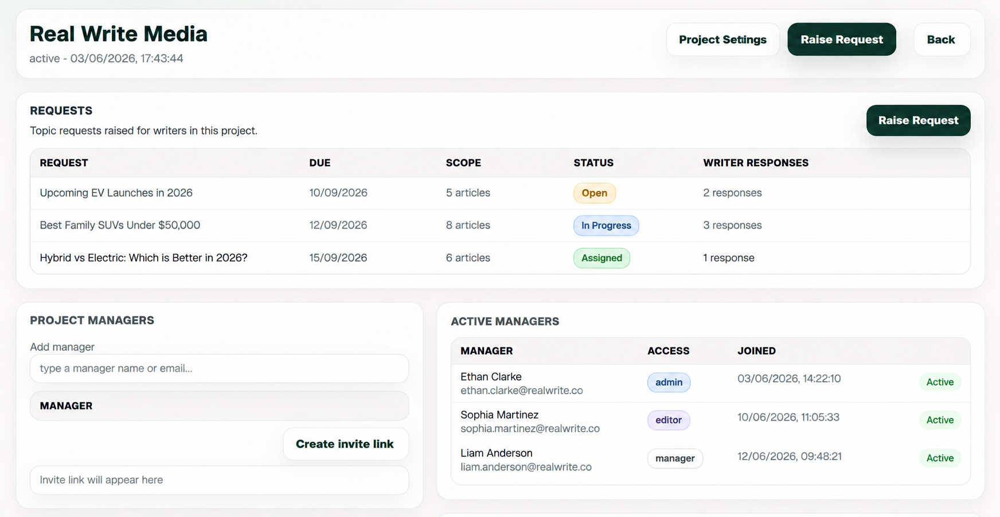
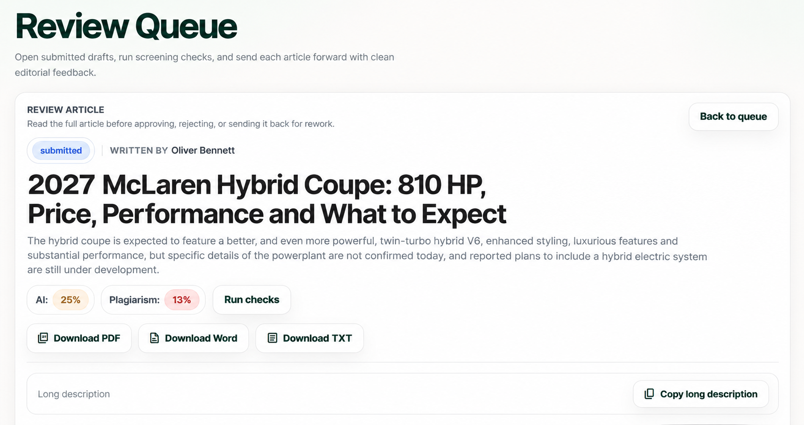
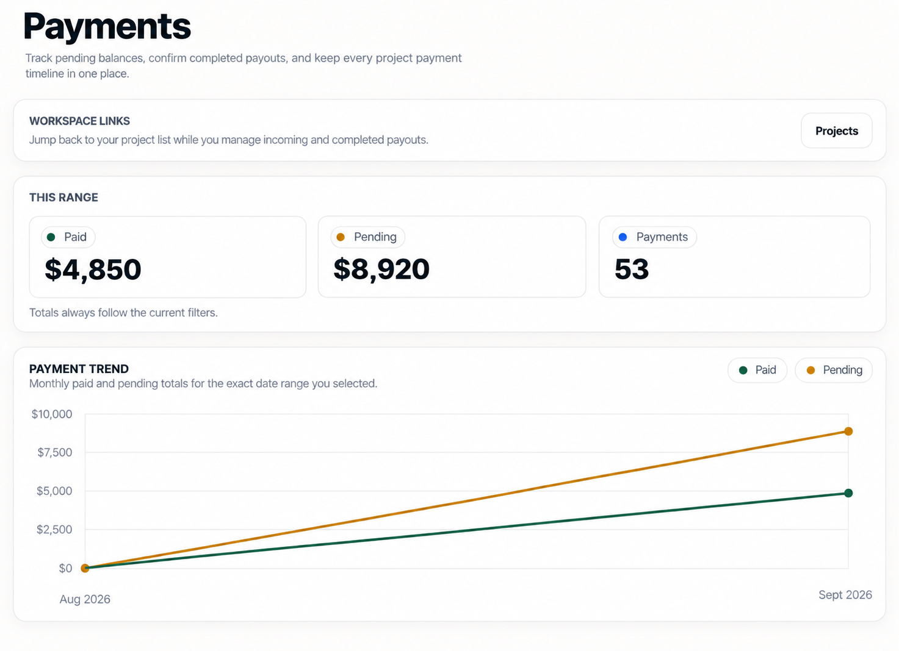
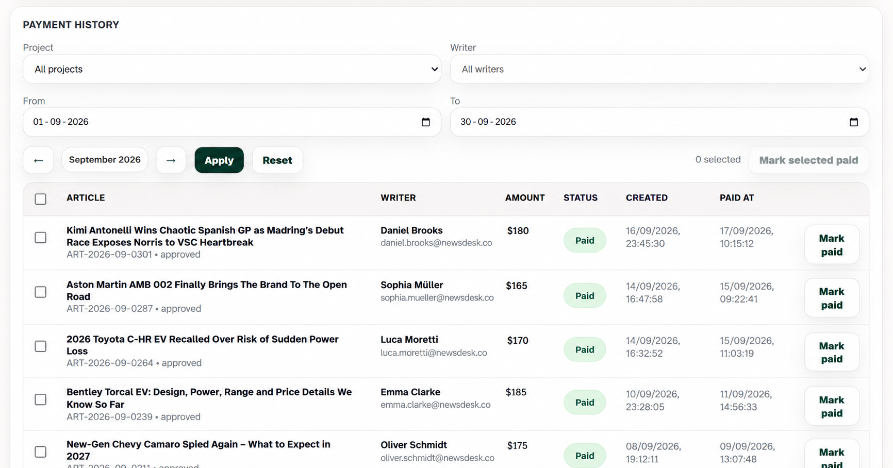

# Real Write

Real Write is an open-source content operations dashboard for teams that manage writers, article requests, editorial reviews, AI checks, plagiarism checks, calendars, messaging, exports, and writer payments.

It is built for writing agencies, content studios, and internal publishing teams that need one self-hosted place to move an article from assignment to approval to payment.


## Why Real Write Exists

Content teams often manage writers across spreadsheets, chats, docs, payment notes, and review queues. Real Write brings those workflows into one application so managers can see what is requested, what is submitted, what needs review, what has been paid, and where each writer stands.

The project is designed to be cloned, connected to your own Supabase and PostgreSQL environment, and run on your own infrastructure.

## Features

- Multi-role workspace for admins, managers, and writers
- Project creation, manager assignment, and writer assignment
- Article request flow with deadlines and instructions
- Writer submission flow with built-in article editor
- Manager review queue with approval and rework states
- Article export workflows
- Writer payment tracking and payment proof uploads
- Calendar notes and deadline visibility
- Project messaging and person-to-person messaging
- Optional AI-likeness checking through Hugging Face
- Built-in plagiarism-style similarity checks against articles already stored in the workspace
- First-run setup page for environment configuration and admin bootstrap

## Demo And Screenshots

The screenshots below show the main workflow: create projects, raise article requests, review submissions, run checks, export drafts, and track payments.

### Project Requests

Managers can create projects, raise article requests, assign writers, and coordinate project access from one place.



### Review Queue

Managers can open submitted drafts, read the full article, run AI and plagiarism checks, and export approved work.



### Payments

Real Write tracks paid and pending balances, payment counts, and project payment trends.



### Payment History

Managers can filter payments by project, writer, and date range, then mark completed payouts as paid.



Demo flow:

```text
Create project -> assign writer -> request article -> submit draft -> run checks -> approve -> mark paid
```

## Tech Stack

- Node.js
- Express
- Supabase Auth
- Supabase Storage
- PostgreSQL
- Static HTML, CSS, and JavaScript frontend

## Architecture

```text
backend/
  api/          Serverless/API entrypoints
  db/           Database bootstrap and schema helpers
  middleware/   Authentication and request middleware
  models/       Data access helpers
  public/       Deployable static frontend served by the backend
  routes/       Express route modules
  services/     AI, plagiarism, export, setup, and domain services
  tools/        Backend maintenance utilities
  utils/        Shared backend helpers

frontend/
  admin/        Admin workspace pages
  assets/       Shared CSS and images
  manager/      Manager workspace pages
  shared/       Shared browser-side utilities
  writer/       Writer workspace pages
```

The editable frontend source lives in `frontend/`. The backend serves the production static copy from `backend/public/`, so keep those folders in sync when changing UI files.

## Requirements

- Node.js 18 or newer
- Supabase project or self-hosted Supabase stack
- PostgreSQL database
- Optional Hugging Face API token for hosted AI detection

## Quick Start

Install backend dependencies:

```bash
npm --prefix backend install
```

Create environment configuration:

```bash
copy backend\.env.example backend\.env
```

Start the application:

```bash
npm --prefix backend start
```

Open:

```text
http://localhost:3000
```

If the app is not configured yet, open:

```text
http://localhost:3000/setup.html
```

## Configuration

The app can be configured through environment variables or through the first-run setup page.

Required environment variables:

```text
SUPABASE_URL
SUPABASE_ANON_KEY
SUPABASE_SERVICE_ROLE_KEY
DATABASE_URL
```

Instead of `DATABASE_URL`, you can provide:

```text
DB_HOST
DB_PORT
DB_USER
DB_PASSWORD
DB_NAME
```

Recommended variables:

```text
APP_NAME
APP_URL
CORS_ORIGINS
SUPABASE_JWT_AUD
```

Optional variables:

```text
DB_SSL
HUGGINGFACE_API_TOKEN
AI_DETECTOR_MODEL
DEPLOY_TOKEN
```

Optional admin bootstrap variables:

```text
BOOTSTRAP_ADMIN_FULL_NAME
BOOTSTRAP_ADMIN_EMAIL
BOOTSTRAP_ADMIN_PASSWORD
```

## First-Run Setup

Real Write includes a setup page at `/setup.html`.

The setup flow can:

- Save application configuration
- Connect Supabase
- Connect PostgreSQL
- Prepare the application schema
- Create the first admin account
- Configure optional AI detection

For local and simple self-hosted installs, setup values may be saved to:

```text
backend/.runtime-config.json
```

That file contains secrets and should stay private. For production, environment variables are the safer long-term option.

## AI Detection And Plagiarism Checks

AI detection is optional.

If `HUGGINGFACE_API_TOKEN` is configured, the backend can call the configured Hugging Face model. If the hosted model is unavailable, the app can fall back to a lighter heuristic check.

Plagiarism checking does not require a third-party plagiarism API. The current checker compares submitted articles against articles already stored in the workspace database and reports similarity signals.

## Typical Workflow

1. Admin connects Supabase and PostgreSQL.
2. Admin creates manager and writer accounts.
3. Manager creates a project.
4. Manager assigns writers to the project.
5. Manager creates article requests with deadlines.
6. Writer submits drafts through the writer dashboard.
7. Manager reviews, approves, requests rework, or exports the draft.
8. Manager tracks payment and uploads payment proof.
9. Writers can review their submission and payment history.

## Roadmap

- Add polished public screenshots and a short demo video
- Add a hosted demo environment with sample data
- Add stronger AI detection provider options
- Add more advanced plagiarism provider integrations
- Add richer analytics for managers and admins
- Add contributor-friendly seed data
- Add automated end-to-end test coverage
- Add Docker-based self-hosting instructions

## Good First Issues

Good starter tasks for contributors:

- Add screenshots to `docs/screenshots/`
- Improve setup documentation for self-hosting
- Add seed/sample data for demo environments
- Add UI empty states for dashboards
- Add automated tests for article review routes
- Add Docker Compose instructions
- Improve accessibility labels in frontend pages

When you open GitHub issues, label these with `good first issue`.

## Contributing

Contributions are welcome once the repository is public.

Recommended contribution flow:

1. Open an issue describing the bug or feature.
2. Fork the repository.
3. Create a focused branch.
4. Make the smallest useful change.
5. Test the affected workflow.
6. Open a pull request with screenshots or notes when UI behavior changes.

## Security Notes

Before deploying or publishing your fork:

- Remove real project data
- Check for secrets in `.env` files and runtime config files
- Protect Supabase service role keys
- Keep `backend/.runtime-config.json` private
- Configure `APP_URL` and `CORS_ORIGINS` for your production domain

## Deployment

The simplest deployment is to run the Express backend and serve the static frontend from the same host.

Possible hosting approaches:

- Node process with PM2
- VPS behind Nginx or Caddy
- Docker-based deployment
- Vercel for lightweight API/static hosting, with external services for heavier AI checks

## License

No license file is currently included. Add a license before promoting the repository as open source. MIT is usually the simplest choice for a public application template, but choose the license that matches your goals.

## Blog Ideas

If you are writing about Real Write, useful technical angles include:

- Why spreadsheets break down for content operations
- How role-based dashboards shape the product architecture
- How article review, payment tracking, and messaging connect in one workflow
- How to add AI detection without making it the core product
- Why self-hosting matters for agencies handling client content
- What you learned building a Supabase-backed editorial system
